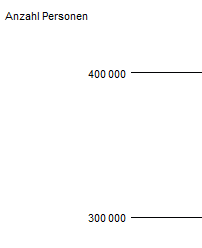
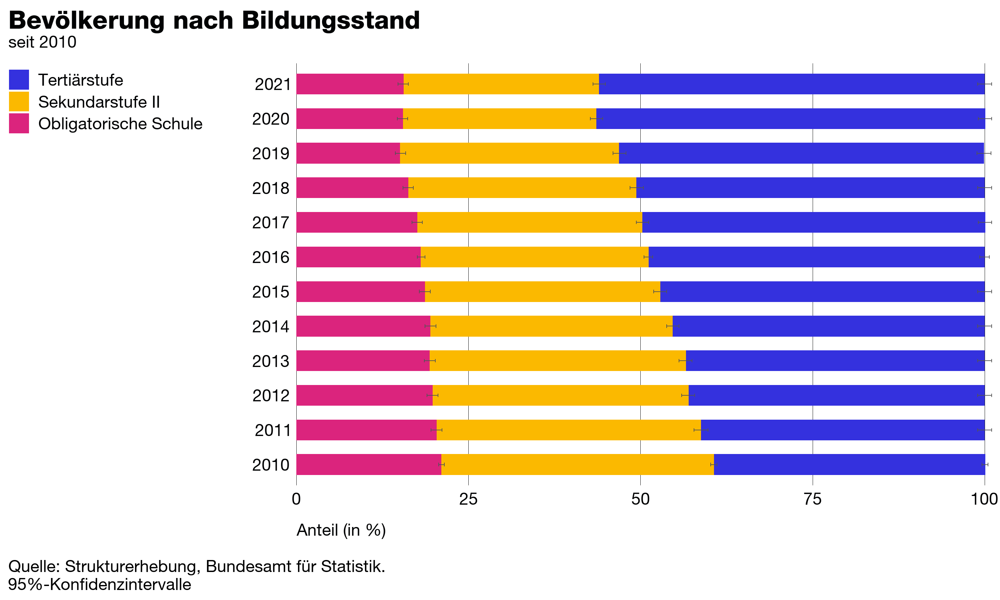
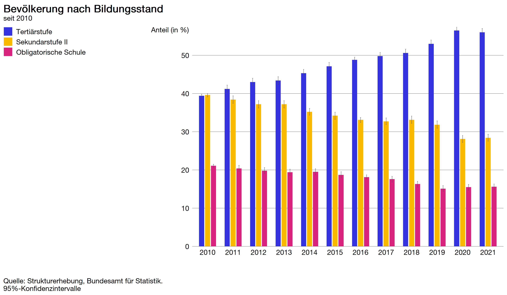
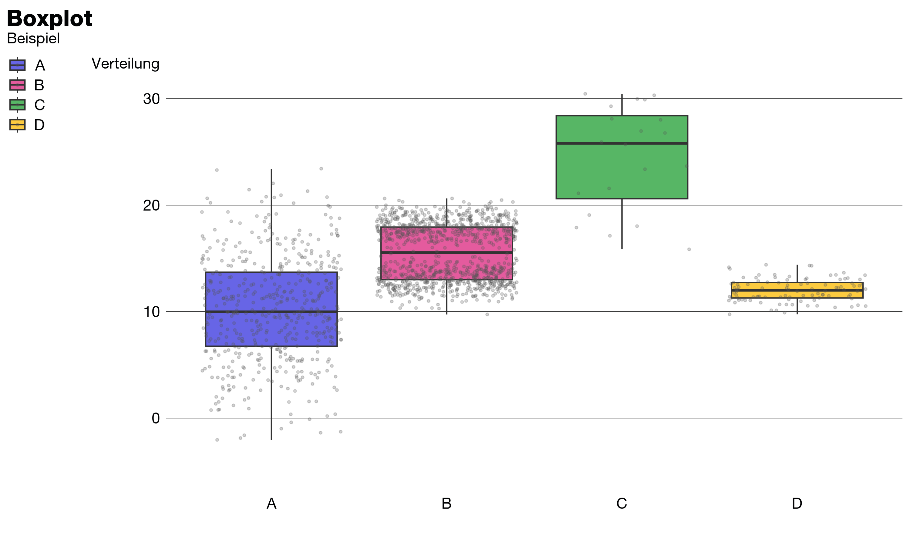
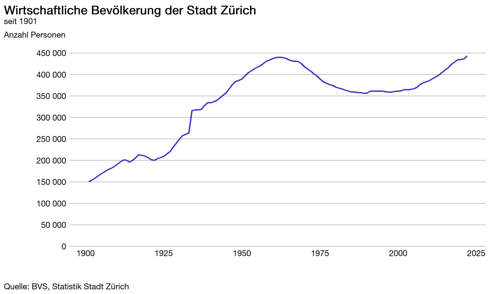
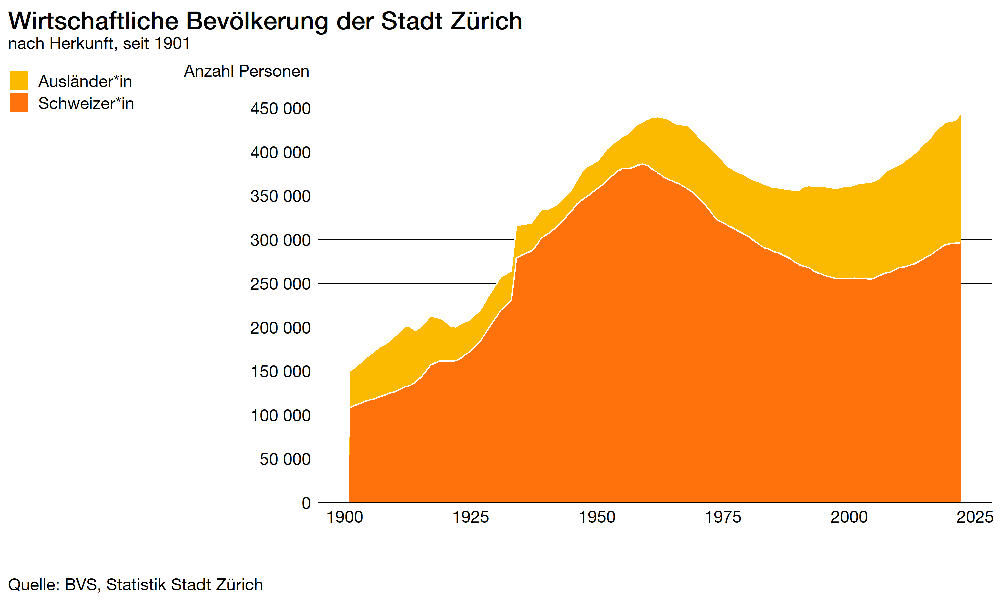
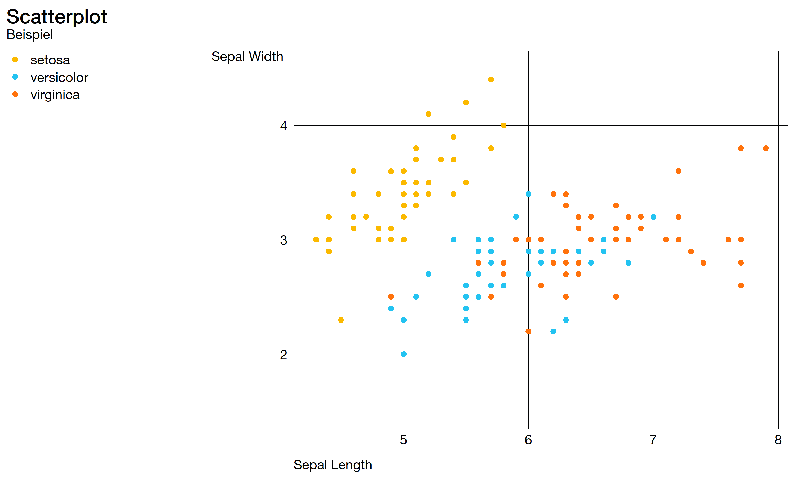
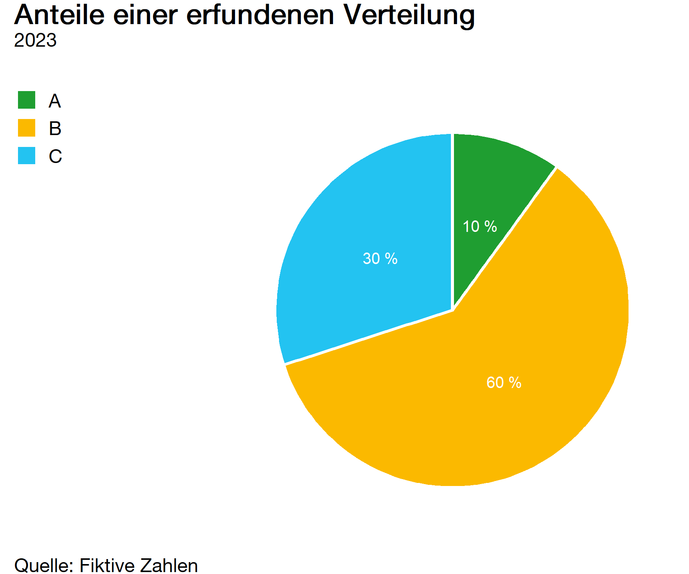

# zueriplots

Dieses Repository dient als Anleitung für die CI/CD-konforme Erstellung von ggplots mithilfe von [zueritheme](https://github.com/StatistikStadtZuerich/zueritheme) und [zuericolors](https://github.com/StatistikStadtZuerich/zuericolors).

Die `ssz_theme(...)`-Funktion aus dem `zueritheme`-Package übernimmt dabei die meisten Styling-Aufgaben. Bevor losgelegt werden kann, müssen `zueritheme` und `zuericolors` sowie die offizielle Font `HelveticaNeueLTPro` auf dem eigenen Rechner installiert werden.

## HelveticaNeueLTPro

Die Font HelveticaNeueLTPro muss zuerst im Softwarecenter bestellt und installiert werden. Danach wird das `extrafont`-Package benötigt und mit der `font_import()`-Funktion die Schrift installiert. Mit der Funktion `windwosFonts()` sieht man, welche Schriften vom System in R verfügbar sind. Mithilfe von `loadfonts(device = "win")` wird die entsprechende Schrift geladen.

``` r
# install.packages("extrafont")
library(extrafont)
font_import(pattern = "HelveticaNeueLTPro-Roman.ttf")
loadfonts(device = "win")
windowsFonts()
```

## Zusätzliches, manuelles Styling
Die `ssz_theme(...)`-Funktion übernimmt nicht ganz alle Styling-Aufgaben, welche das CI/CD der Stadt Zürich vorschrebit. Namentlich betrifft dies die Position der Achsenbeschriftung sowie des Halbgeviert.

### Achsenbeschriftungen
Die Achsenbeschriftungen bzw. ihre Position und Margin orientieren sich bei `ggplot2` an den Achsen-Labels. In `zueritheme` wird die z.B. die Y-Achsenbeschriftungen oben links an der Y-Achse rechtsbündig an den Achsen-Labels positioniert:



Da  die Position der Achsenbeschriftungen daher von der Skalierung (oder den Kategorien) der dargestellten Variable abhängig ist, muss die Beschriftung mit `margin(r = ...)` in einer zusätzlichen `theme()`-Funktion positioniert werden.

``` r
ggplot(...) +
  geom_bar(...) +
  ssz_theme(grid_lines = "y") +
  theme(axis.title.y = element_text(
    margin = margin(t = 0, r = -27, b = 0, l = 0)
  ))
```

### Halbgeviert
Einen halbgevierten Abstand bei den 1000er kann wie folgt implementiert werden (Beispiel numerische Y-Achse):

``` r
ggplot(...) +
  geom_bar(...) +
  scale_y_continous(labels = function(x) format(x,
                                                big.mark = "\u2009", 
                                                scientific = FALSE),
                    ...) +
  ssz_theme(grid_lines = "y")
```

## Bar Chart
[Bar Charts](https://r-graph-gallery.com/barplot.html) sind die wohl am häufigsten verwendeten Grafiktypen.

### Simpler Bar Chart
Den R-Code für diese Grafik findetst du [hier](https://cmp-sdlc.stzh.ch/OE-7035/ssz-da/zueriverse/zueriplots/-/blob/feature/chart_types/R/bar_chart.R).


### Stacked Bar Chart
Den R-Code für diese Grafik findetst du [hier](https://cmp-sdlc.stzh.ch/OE-7035/ssz-da/zueriverse/zueriplots/-/blob/feature/chart_types/R/stacked_bar_chart.R).



### Grouped Bar Chart
Den R-Code für diese Grafik findetst du [hier](https://cmp-sdlc.stzh.ch/OE-7035/ssz-da/zueriverse/zueriplots/-/blob/feature/chart_types/R/grouped_bar_chart.R).



### Pyramid Chart
Den R-Code für diese Grafik findetst du [hier](https://cmp-sdlc.stzh.ch/OE-7035/ssz-da/zueriverse/zueriplots/-/blob/feature/chart_types/R/pyramid_chart.R).


### Histogram Chart
Den R-Code für diese Grafik findetst du [hier](https://cmp-sdlc.stzh.ch/OE-7035/ssz-da/zueriverse/zueriplots/-/blob/feature/chart_types/R/histogram_chart.R).

## Boxplot Chart
Den R-Code für diese Grafik findetst du [hier](https://cmp-sdlc.stzh.ch/OE-7035/ssz-da/zueriverse/zueriplots/-/blob/feature/chart_types/R/boxplot_chart.R).



## Line Chart
Den R-Code für diese Grafik findetst du [hier](https://cmp-sdlc.stzh.ch/OE-7035/ssz-da/zueriverse/zueriplots/-/blob/feature/chart_types/R/line_chart.R).



## Area Chart
Den R-Code für diese Grafik findetst du [hier](https://cmp-sdlc.stzh.ch/OE-7035/ssz-da/zueriverse/zueriplots/-/blob/feature/chart_types/R/area_chart.R).



## Scatterplot Chart
Den R-Code für diese Grafik findetst du [hier](https://cmp-sdlc.stzh.ch/OE-7035/ssz-da/zueriverse/zueriplots/-/blob/feature/chart_types/R/scatterplot_chart.R).



## Pie Chart
Den R-Code für diese Grafik findetst du [hier](https://cmp-sdlc.stzh.ch/OE-7035/ssz-da/zueriverse/zueriplots/-/blob/feature/chart_types/R/pie_chart.R).



