# zueriplots

The goal of this repository is to provide minimal code examples for [ggplot2](https://ggplot2.tidyverse.org/) graphics that conform to the corporate identity/design of the [city of Zurich](https://www.stadt-zuerich.ch/portal/de/index.html). Most of the required styling is done by [zueritheme](https://github.com/StatistikStadtZuerich/zueritheme), while the [zuericolors](https://github.com/StatistikStadtZuerich/zuericolors) package provide the official color palettes.

Note that this is an R package only for documentation purposes, it does not provide any exported functions.

## Overview

The `ssz_theme(...)` function from the `zueritheme` package provides most of the styling. However, in order for `ggplot2` graphics to conform to the corporate design, a few manual steps are still necessary. These steps will be explained below.

Before you can start, you have to install `zueritheme` and `zuericolors` as well as Zurich's official font `HelveticaNeueLTPro` (only available for city employees).

Further below you can find code examples of the most commonly used graph types.

## Installing the required packages from the zueriverse

Install zuericolors from GitHub
```r
# install.packages("pak")
pak::pak("StatistikStadtZuerich/zuericolors")
```

Install zueritheme from GitHub
```r
# install.packages("pak")
pak::pak("StatistikStadtZuerich/zueritheme")
```

## Installing the font

The following instructions are intended for employees of the city of Zurich working on a Windows computer. Instructions for other operating systems are currently not available.

`HelveticaNeueLTPro` must be ordered in the software center and installed on your computer. To make it available, it is important to copy the font-related files from `C:\Program Files\Common Files\Adobe\Fonts` to `c:\windows\Fonts`. The font's system path will then be used in the `font_add()` function from the `showtext` package in order to import the font and make it accessible for R. `family` is the parameter that will be used when plotting within the `ssz_theme()` function.

``` r
# install.packages("rappdirs")
# install.packages("showtext")
library(extrafont)
library(rappdirs)

path_to_font <- file.path(user_config_dir(roaming = FALSE, os = "win"), "Microsoft", "Windows", "Fonts")

font_add(family = "Helv",
         regular = file.path(path_to_font, "HelveticaNeueLTPro-Roman.ttf"),
         bold = file.path(path_to_font, "HelveticaNeueLTPro-Hv.ttf"))
         
showtext_auto()
showtext_opts(dpi = 300)
```

Before creating a graphic, it is recommended to invoke `showtext_auto()` so that the graphic text is rendered using `showtext`. The resolution of the graphic is controlled by using `showtext_opts(dpi = 300)`.

## Additional Manual Styling
The `ssz_theme(...)` function does not take over all styling tasks that the CI/CD of the city of Zurich prescribes. Namely, the position of the axis titles as well as the spacing for the ten thousand numbers (see picture below) still need additional manual adjustment.

### Axis Titles
In `ggplot2` the axis titles are positioned relative to the axis tick labels. For `zueritheme` this means that e.g. the y-axis titles are positioned at the top left of the y-axis, right-justified at the axis tick labels.

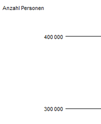

Since the position of the axis titles therefore depends on the scaling (or length of strings if categories) of the displayed variable, the title must be positioned with `margin(r = ...)` in addition to the `theme()` function in order to conform to the corporate design. The axis title should be right-justified and aligned with the axis labels. In the example below we set the right-margin to -27.

``` r
ggplot(...) +
  geom_bar(...) +
  ssz_theme(grid_lines = "y") +
  theme(axis.title.y = element_text(
    margin = margin(t = 0, r = -27, b = 0, l = 0)
  ))
```
The value of the right margin of the axis title for this example should be adjusted to -27 so it looks something like this:

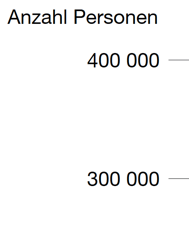

### Spacing for the Ten Thousand Numbers
In order to get a nice spacing for the ten thousand numbers, we need to format the labels with `big.mark = " "` when applying the `scale_y_continuous` function (or `scale_x_continuous` if numeric values are shown on the x axis).

``` r
ggplot(...) +
  geom_bar(...) +
  scale_y_continuous(labels = function(x) format(x,
                                                big.mark = " ", 
                                                scientific = FALSE),
                    ...) +
  ssz_theme(grid_lines = "y")
```

# Different plot types

Example code for the most commonly used graphic types at [Statistik Stadt Zürich](https://www.stadt-zuerich.ch/prd/de/index/statistik.html) is provided below.

## Bar Chart
### Simple Bar Chart
You can find the R code for this graphic [here](inst/examples/bar_chart.R).

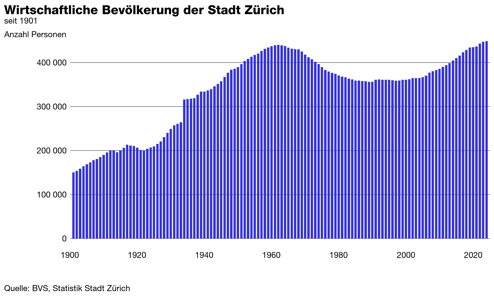

### Stacked Bar Chart
You can find the R code for this graphic [here](inst/examples/stacked_bar_chart.R).

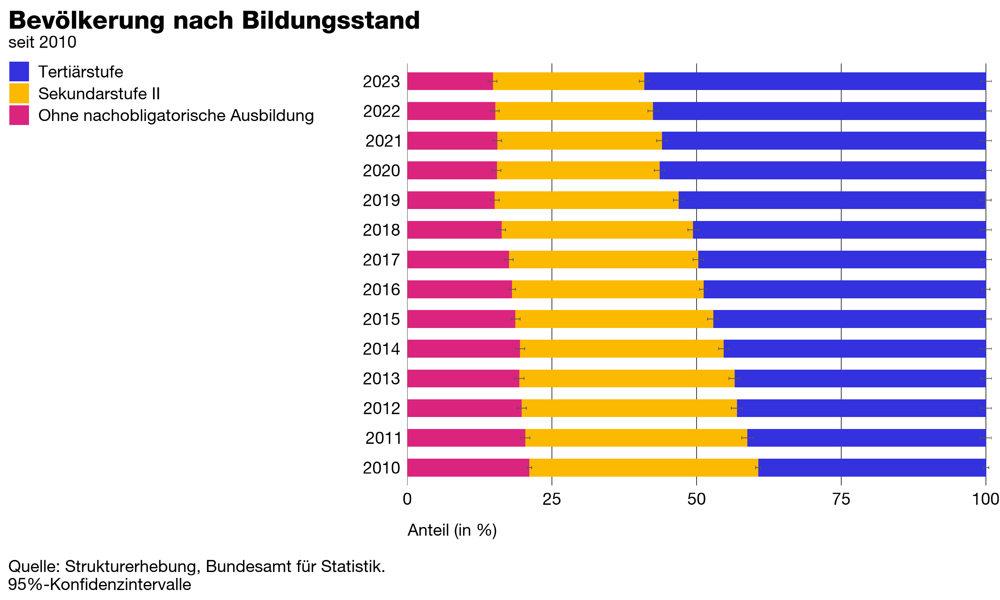

### Grouped Bar Chart
You can find the R code for this graphic [here](inst/examples/grouped_bar_chart.R).

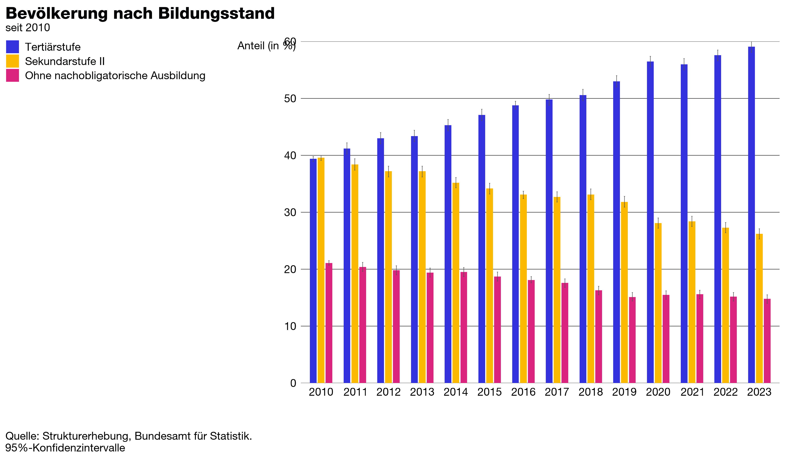

## Pyramid Chart
You can find the R code for this graphic [here](inst/examples/pyramid_chart.R).

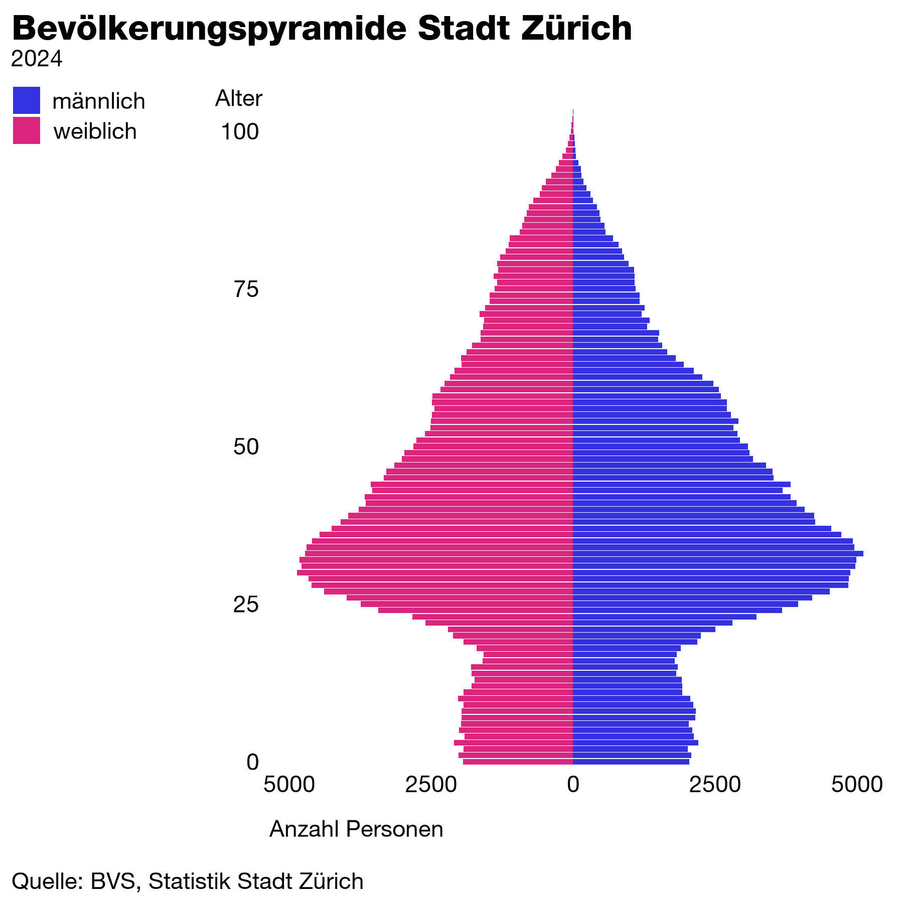

## Histogram Chart
You can find the R code for this graphic [here](inst/examples/histogram_chart.R).

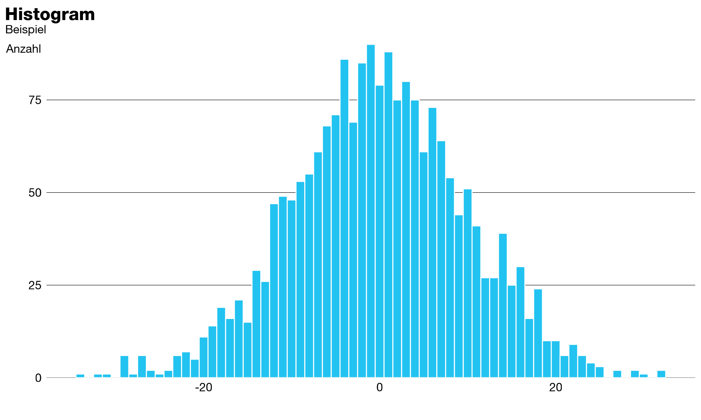

## Boxplot Chart
You can find the R code for this graphic [here](inst/examples/boxplot_chart.R).

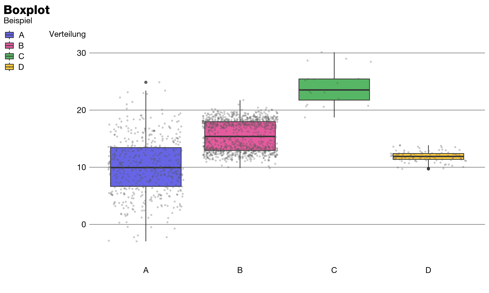

## Line Chart
You can find the R code for this graphic [here](inst/examples/line_chart.R).

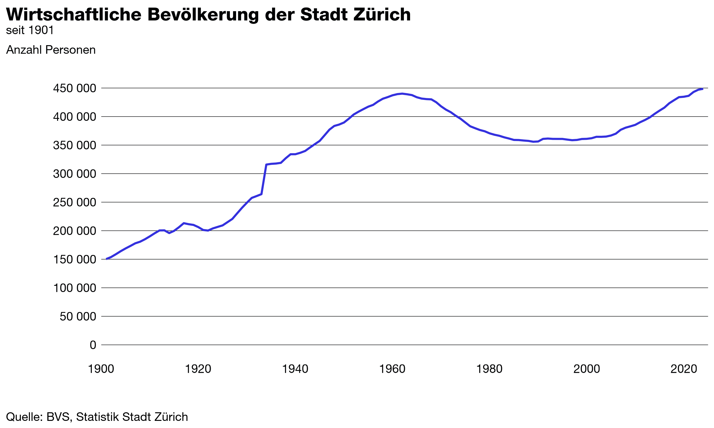

## Area Chart
You can find the R code for this graphic [here](inst/examples/area_chart.R).

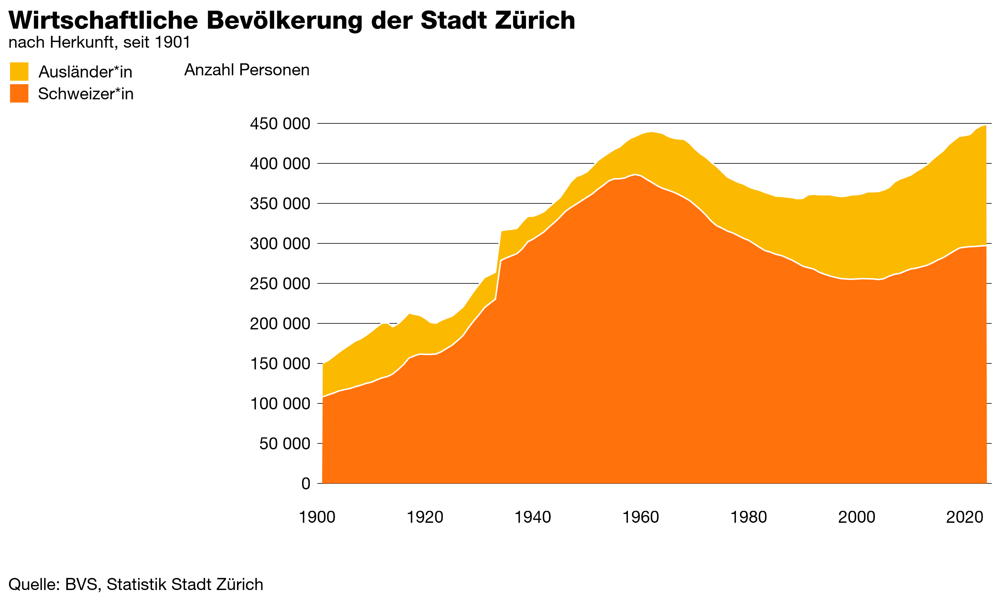

## Scatterplot Chart
You can find the R code for this graphic [here](inst/examples/scatterplot_chart.R).

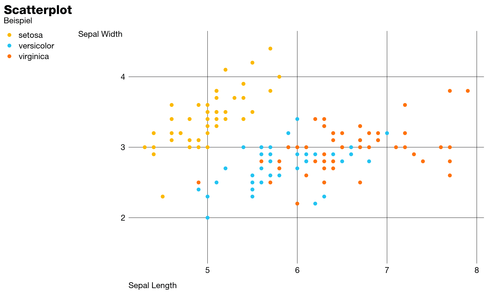

## Pie Chart
You can find the R code for this graphic [here](inst/examples/pie_chart.R).

Note: Pie charts are usually used to show the relationship between parts and the whole of a data set, i.e. how big part A is in relation to part B, C, etc. The problem with pie charts is that they force us to compare areas (or angles), which is often quite difficult to do. Furthermore, pie charts are only used when manageable number of groups are to be compared and these groups are easily distinguishable by color.

We recommend using an alternative chart type if possible.

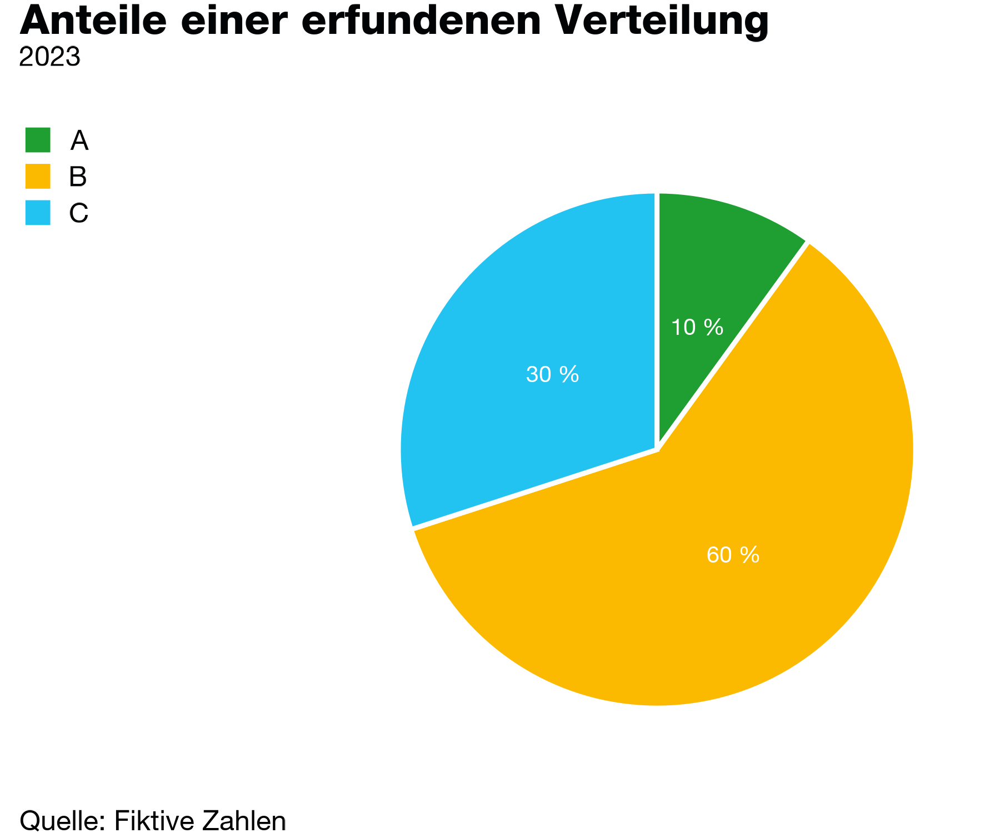

## Doughnut Chart
You can find the R code for this graphic [here](inst/examples/doughnut_chart.R).


## Heatmap Chart
You can find the R code for this graphic [here](inst/examples/heatmap_chart.R).

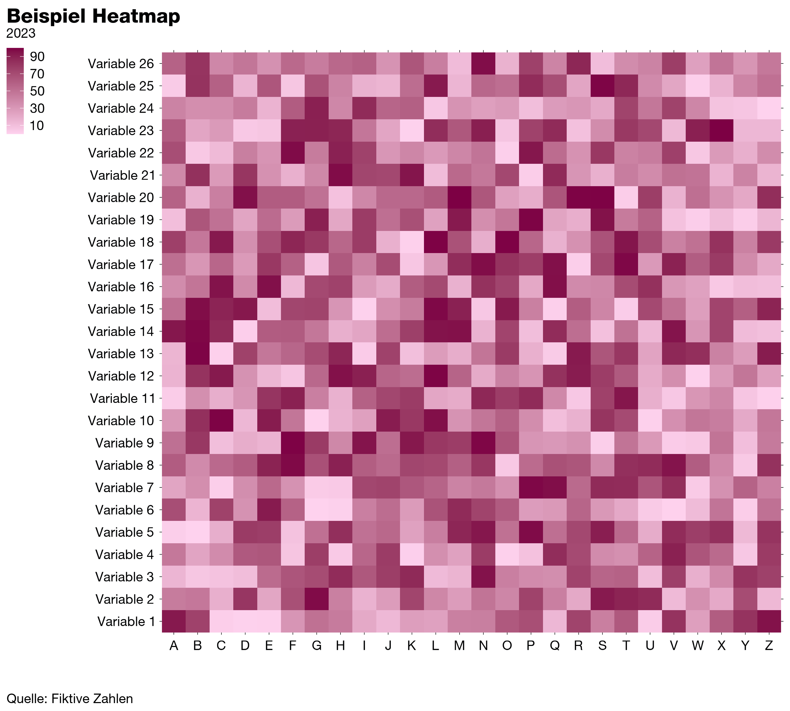

## Ridgeline Chart
You can find the R code for this graphic [here](inst/examples/ridgeline_chart.R).

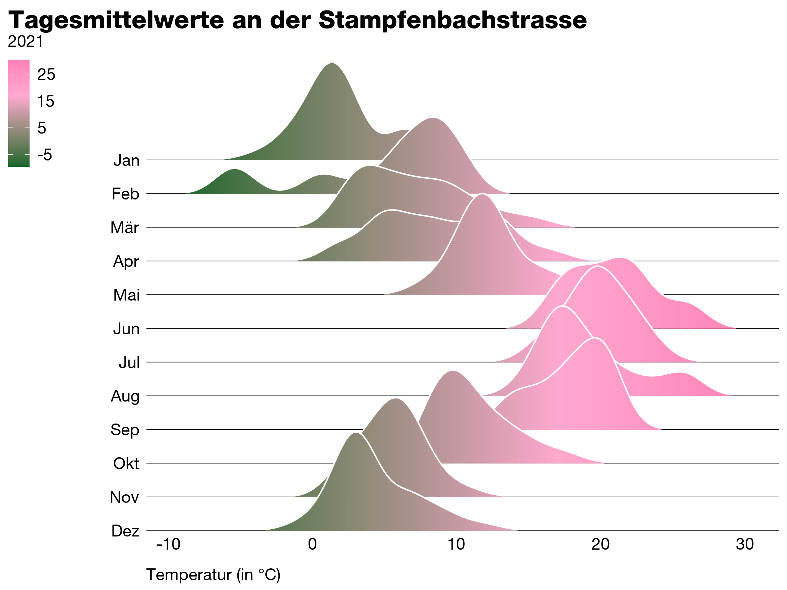

## Map Chart
You can find the R code for this graphic [here](inst/examples/map_chart.R).

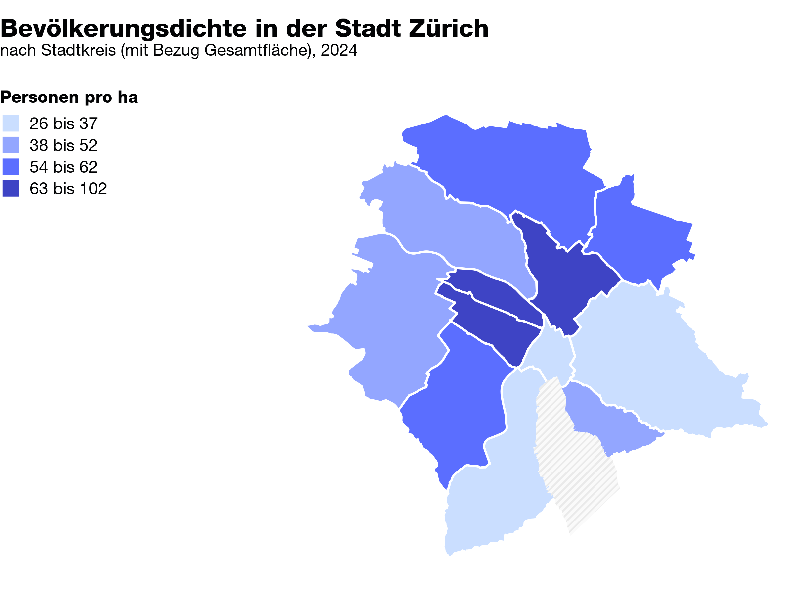

## Getting Help
If you encounter a bug, please contact [statistik\@zuerich.ch](mailto:statistik@zuerich.ch).
