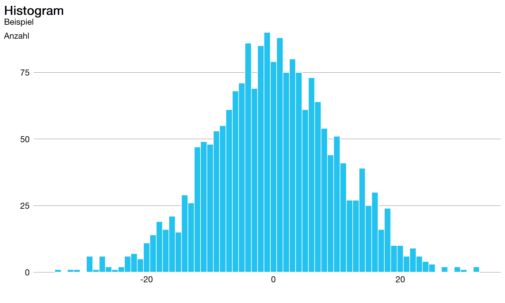
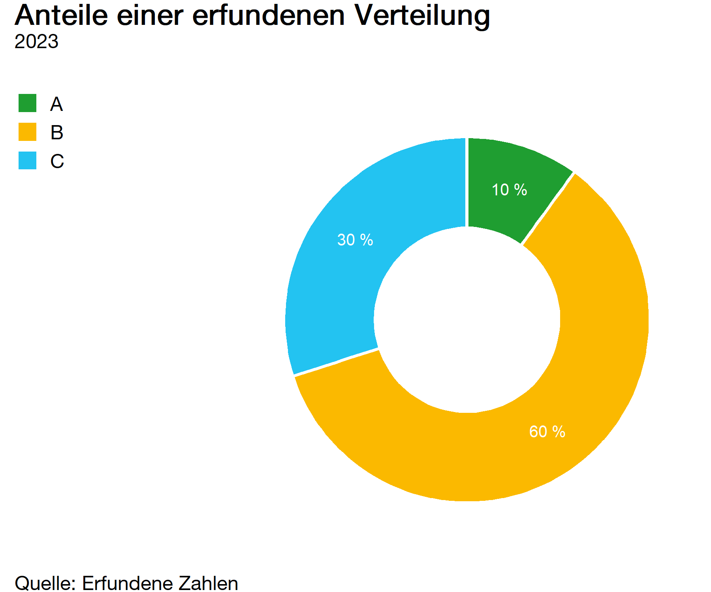
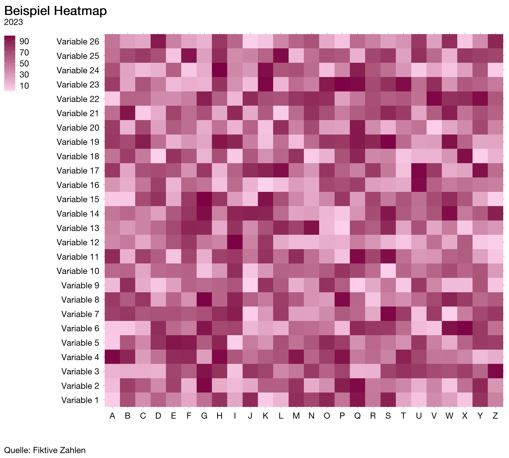
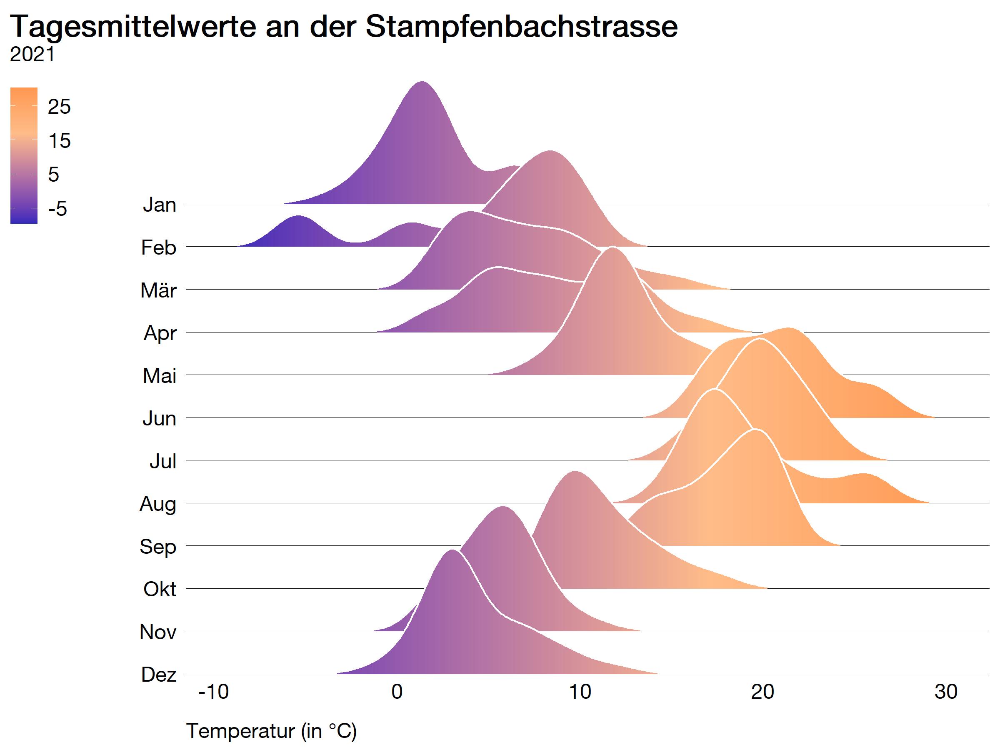
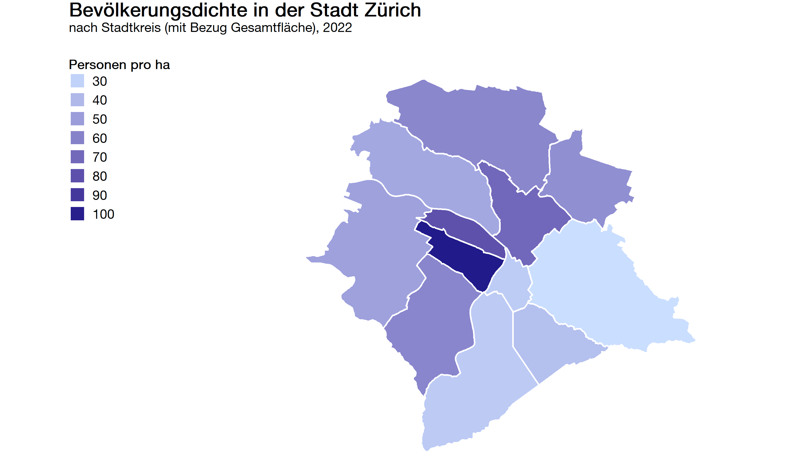

# zueriplots

The goal of this repository is to provide minimal code examples for [ggplot2](https://ggplot2.tidyverse.org/) graphs that conform to the corporate identity/design of the [city of Zurich](https://www.stadt-zuerich.ch/portal/de/index.html). Most of the required styling is done by [zueritheme](https://github.com/StatistikStadtZuerich/zueritheme), while the [zuericolors](https://github.com/StatistikStadtZuerich/zuericolors) package takes care of the colors.

The `ssz_theme(...)` function from the `zueritheme` package takes care of most of the required styling tasks. However, in order for `ggplot2` graphs to conform to the corporate design, a few manual steps are still necessary. These steps will be explained in the following.

Before you can start, you have to install `zueritheme` and `zuericolors` as well as Zurich's official font `HelveticaNeueLTPro` (only available for city employees) on your own computer.

## HelveticaNeueLTPro

The font HelveticaNeueLTPro must first be ordered in the software center and installed on your computer. The `font_import()` function from the `extrafont` package imports the font and makes it accessable for R Studio. Run `windwosFonts()` in order to see what fonts are available from your system. Finally, the font is loaded with `loadfonts(device = "win")` for Windows devices.

``` r
# install.packages("extrafont")
library(extrafont)
font_import(pattern = "HelveticaNeueLTPro-Roman.ttf")
loadfonts(device = "win")
windowsFonts()
```

## Additional Manual Styling
The `ssz_theme(...)` function does not take over all styling tasks that the CI/CD of the city of Zurich prescribes. Namely, this concerns the position of the axis titles as well as the spacing for the ten thousand numbers (see picture below).

### Axis Titles
In `ggplot2` the axis titles or their position and margin are oriented to the axis labels. In `zueritheme` this means that e.g. the y-axis titles are positioned at the top left of the y-axis, right-justified at the axis labels.


Since the position of the axis titles therefore depends on the scaling (or length of strings if categories) of the displayed variable, the title must be positioned with `margin(r = ...)` in an additional `theme()` function.

``` r
ggplot(...) +
  geom_bar(...) +
  ssz_theme(grid_lines = "y") +
  theme(axis.title.y = element_text(
    margin = margin(t = 0, r = -27, b = 0, l = 0)
  ))
```

### Spacing for the Ten Thousand Numbers
In order to get a nice spacing for the ten thousand numbers, we need to maniuplate the labels' format with `big.mark = " "` when applying the `scale_y_continous` function.

``` r
ggplot(...) +
  geom_bar(...) +
  scale_y_continous(labels = function(x) format(x,
                                                big.mark = " ", 
                                                scientific = FALSE),
                    ...) +
  ssz_theme(grid_lines = "y")
```
Example code for the most commonly used graph types at [Statistik Stadt Zürich](https://www.stadt-zuerich.ch/prd/de/index/statistik.html) is provided below.

## Bar Chart
### Simple Bar Chart
You can find the R code for this graphic [here](https://cmp-sdlc.stzh.ch/OE-7035/ssz-da/zueriverse/zueriplots/-/blob/feature/chart_types/R/bar_chart.R).


### Stacked Bar Chart
You can find the R code for this graphic [here](https://cmp-sdlc.stzh.ch/OE-7035/ssz-da/zueriverse/zueriplots/-/blob/feature/chart_types/R/stacked_bar_chart.R).


### Grouped Bar Chart
You can find the R code for this graphic [here](https://cmp-sdlc.stzh.ch/OE-7035/ssz-da/zueriverse/zueriplots/-/blob/feature/chart_types/R/grouped_bar_chart.R).


### Pyramid Chart
You can find the R code for this graphic [here](https://cmp-sdlc.stzh.ch/OE-7035/ssz-da/zueriverse/zueriplots/-/blob/feature/chart_types/R/pyramid_chart.R).


### Histogram Chart
You can find the R code for this graphic [here](https://cmp-sdlc.stzh.ch/OE-7035/ssz-da/zueriverse/zueriplots/-/blob/feature/chart_types/R/histogram_chart.R).



## Boxplot Chart
You can find the R code for this graphic [here](https://cmp-sdlc.stzh.ch/OE-7035/ssz-da/zueriverse/zueriplots/-/blob/feature/chart_types/R/boxplot_chart.R).


## Line Chart
You can find the R code for this graphic [here](https://cmp-sdlc.stzh.ch/OE-7035/ssz-da/zueriverse/zueriplots/-/blob/feature/chart_types/R/line_chart.R).


## Area Chart
You can find the R code for this graphic [here](https://cmp-sdlc.stzh.ch/OE-7035/ssz-da/zueriverse/zueriplots/-/blob/feature/chart_types/R/area_chart.R).


## Scatterplot Chart
You can find the R code for this graphic [here](https://cmp-sdlc.stzh.ch/OE-7035/ssz-da/zueriverse/zueriplots/-/blob/feature/chart_types/R/scatterplot_chart.R).


## Pie Chart
You can find the R code for this graphic [here](https://cmp-sdlc.stzh.ch/OE-7035/ssz-da/zueriverse/zueriplots/-/blob/feature/chart_types/R/pie_chart.R).

Note: Pie charts are usually used to show the relationship between parts and the whole of a data set. I.e. how big part A is in relation to part B, C, etc. The problem with pie charts is that they force us to compare areas (or angles), which is often quite difficult to do. Furthermore, pie charts are only used when manageable number of groups are to be compared and these groups are easily distinguishable by color.


## Doughnut Chart
You can find the R code for this graphic [here](https://cmp-sdlc.stzh.ch/OE-7035/ssz-da/zueriverse/zueriplots/-/blob/feature/chart_types/R/doughnut_chart.R).



## Heatmap Chart
You can find the R code for this graphic [here](https://cmp-sdlc.stzh.ch/OE-7035/ssz-da/zueriverse/zueriplots/-/blob/feature/chart_types/R/heatmap_chart.R).



## Ridgeline Chart
You can find the R code for this graphic [here](https://cmp-sdlc.stzh.ch/OE-7035/ssz-da/zueriverse/zueriplots/-/blob/feature/chart_types/R/ridgeline_chart.R).



## Map Chart
You can find the R code for this graphic [here](https://cmp-sdlc.stzh.ch/OE-7035/ssz-da/zueriverse/zueriplots/-/blob/feature/chart_types/R/map_chart.R).



## Getting Help
If you encounter a bug, please contact statistik@zuerich.ch.
